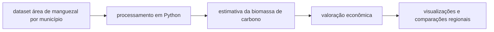

# valoracao_manguezais_municipios_brasileiros
Valoração Econômica do Carbono em Manguezais Brasileiros

Disciplina: Programação para Ciência de Dados

Curso: MBA Ciência de Dados - UNIFOR

Instrutor: Cássio Pinheiro

Integrante: Leonardo Mesquita Pinto (2528979)

Repositório GitHub: (https://github.com/leopinto718/valoracao_manguezais_municipios_brasileiros/tree/main)

Data de Entrega: 14/11/2025

2. Objetivo do Projeto

O objetivo deste projeto é estimar a biomassa de carbono estocada em ecossistemas de manguezal nos municípios brasileiros a partir da área total de manguezal. A partir dessa estimativa é feito um exercício de valoração econômica, calculando o potencial de receita financeira que cada município poderia gerar no mercado de créditos de carbono, caso estes estoques de carbono fossem efetivamente protegidos.

Além da estimativa individual por município, o projeto compara diferentes regiões do Brasil em termos de:

- área total de manguezal
- biomassa total de carbono estocado
- potencial econômico em créditos de carbono

Esse tipo de análise é útil para gestores ambientais, tomadores de decisão, secretarias estaduais/municipais de meio ambiente e também para políticas públicas de mitigação de mudanças climáticas, uma vez que manguezais são um dos ecossistemas mais eficientes do planeta em sequestrar carbono.

3. Diagrama de Contexto (Mermaid)

4. Funcionalidades Implementadas

| Funcionalidade | O que faz | Conceito do curso demonstrado |
|---|---|---|
| Leitura da tabela CSV de manguezais | Lê e carrega os dados de área de manguezal (hectares) | Pandas (Módulo 2) |
| Limpeza e padronização dos nomes | Ajustes básicos e tratamento de eventuais inconsistências | Manipulação de strings e DataFrame (Módulo 2) |
| Função `calcular_biomassa()` | Multiplica área (ha) por fator de carbono (tC/ha) | Funções, docstrings e tipos básicos (Módulo 1) |
| Função `calcular_valor_economico()` | Converte carbono total para valor econômico usando preço por tCO₂e | Funções + operações numéricas (Módulo 1) |
| Ranking por município e por região | Soma e ordena resultados por grupo (região) | Agrupamentos/Groupby (Módulo 2) |
| Visualização comparativa por região | Barras comparando biomassa e potencial econômico entre regiões | Matplotlib / Seaborn (Módulo 3) |

